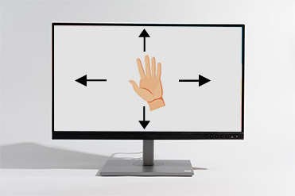
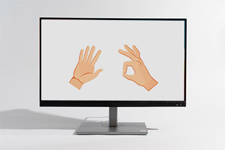
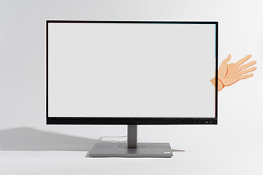
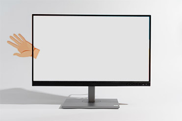

# Control mouse using webcam


Tested on
win11 - Python 3.10


#  Installtion:

1. Clone or download the project.

2. Install the requirements packages.
```
pip install -r requirements.txt
```
3. make sure your webcam connected.

4. **Run "main.py"**


# How to use:


**Move:**



**Left click:**



**Lock mode:**




**Active mode:**




